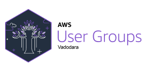
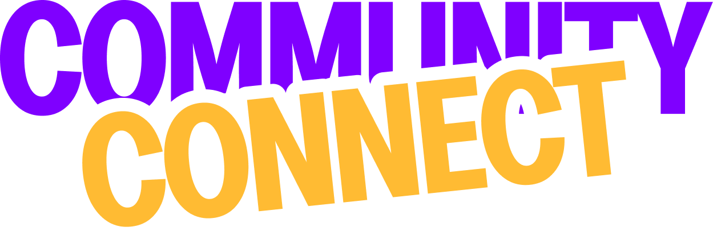
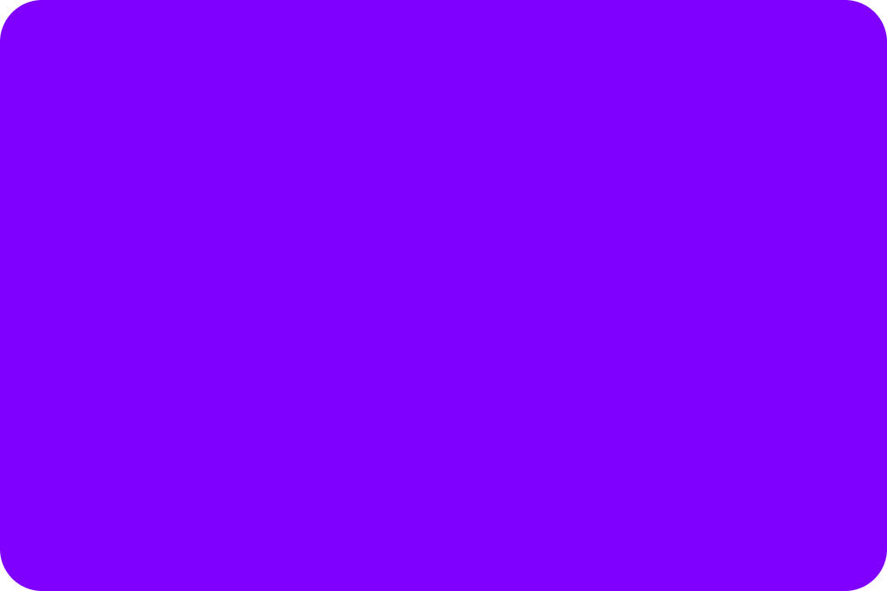
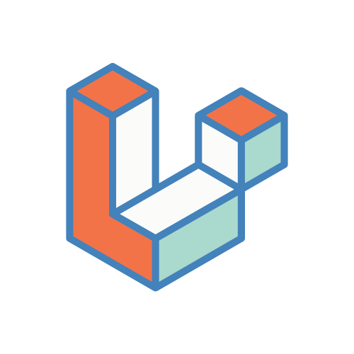

Swipe to navigate

---

<h1 class="intro-title">Laravel Community Vadodara</h1>

We are not the largest community. But we are intentional about who we gather and why we gather.

1st march

---

<h2 class="content-title">What We're Proud Of</h2>
<ul class="content-list">
  <li>A consistent group of 30-40 professional developers</li>
  <li>Strong foundation in PHP and backend engineering</li>
  <li>Serious learners who value technical depth</li>
  <li>Focused participation over casual attendance</li>
</ul>

1st march

---

<h2 class="content-title">What We Aim to Build</h2>
<ul class="content-list">
  <li>Properly curated technical sessions</li>
  <li>Clear topic-focused meetups</li>
  <li>Speaker-audience alignment</li>
  <li>Sessions where attendees know exactly what they will learn</li>
</ul>

1st march

---

<h2 class="content-title">What We Give to the Ecosystem</h2>
<ul class="content-list content-list--tight">
  <li>A technically serious audience</li>
  <li>Curated subject-matter focused sessions</li>
  <li>Quality over quantity events</li>
  <li>A space for deep discussions and real problem-solving</li>
  <li>Collaboration-ready mindset</li>
</ul>

1st march

---

<h2 class="content-title">What We Need</h2>
<ul class="content-list">
  <li>Consistency in hosting meaningful sessions</li>
  <li>Subject-matter experts willing to go deep</li>
</ul>

1st march

---

Clarity. Depth. Intentional growth.

If we collaborate - it will be purposeful.

<h2 class="commitment-title">Our Commitment</h2>

If we host something - it will be meaningful.

1st march

---

<h1 class="thanks">Thank You!</h1>
